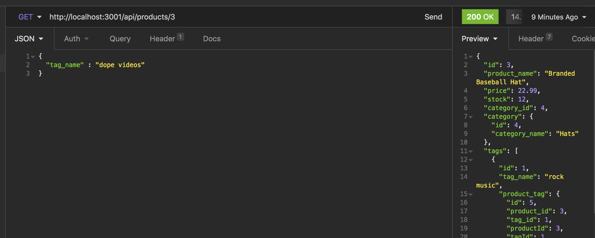

# E-commerce Back End

## Description 

This app is the back-end of an e-commerce website.

For the techies: Using Sequelize to sync with the database, we can make API calls to perfrom CRUD routes on the products, categories, and tags.

For everyone else: You're asking me, "CRUD routes? Sequelize? What are they talking about? I just want to see if this merchant sells shorts!?!" Well, that's exactly what we're talking about! That is category 1! :) Thanks to this back-end, we can pull that information up for you and let you know that "Yes, we do have shorts!" and answer further questions you might have about the price, color, or what have you. This data linking could also be used to present similar products to a customer who is browsing.

[My E-Commerce Back End GitHub Repository](https://github.com/Clayto30/ecommerce-backend).

Here is [Screencastify Walktrhough Video](https://github.com/microsoft/vscode) that demonstrates the technical acceptance criteria being met.

## Table of Contents (Optional)

If your README is very long, add a table of contents to make it easy for users to find what they need.

* [Installation](#installation)
* [Usage](#usage)
* [Credits](#credits)
* [License](#license)

## Installation

After cloning the repository, run npm install so that you have all the dependencies, which include Mysql2, Sequlize, Express, and Dotenv. You'll need to create a dotenv file of your own with your mysql password and username in order to run this.

After that, use the command line to input "npm run seed" and "npm start." Use an interface like Postman or Insomnia Core to test these API routes.

## Usage 

Use an API call to find all the products! After that, use "Post" to create a product! Take the id number and "Put" to update the name of that product if you like! Then why not "Delete" it using that id number, too? This works on Category, Product, and Tag endpoints. 

## Credits

This project was created as a project as part of the UC Berkeley Coding Bootcamp instruction. My instructor and especially those ever-helpful TA's deserve special recognition.

## License

Copyright 2021 Clayton Goff

Permission is hereby granted, free of charge, to any person obtaining a copy of this software and associated documentation files (the "Software"), to deal in the Software without restriction, including without limitation the rights to use, copy, modify, merge, publish, distribute, sublicense, and/or sell copies of the Software, and to permit persons to whom the Software is furnished to do so, subject to the following conditions:

The above copyright notice and this permission notice shall be included in all copies or substantial portions of the Software.

THE SOFTWARE IS PROVIDED "AS IS", WITHOUT WARRANTY OF ANY KIND, EXPRESS OR IMPLIED, INCLUDING BUT NOT LIMITED TO THE WARRANTIES OF MERCHANTABILITY, FITNESS FOR A PARTICULAR PURPOSE AND NONINFRINGEMENT. IN NO EVENT SHALL THE AUTHORS OR COPYRIGHT HOLDERS BE LIABLE FOR ANY CLAIM, DAMAGES OR OTHER LIABILITY, WHETHER IN AN ACTION OF CONTRACT, TORT OR OTHERWISE, ARISING FROM, OUT OF OR IN CONNECTION WITH THE SOFTWARE OR THE USE OR OTHER DEALINGS IN THE SOFTWARE.
